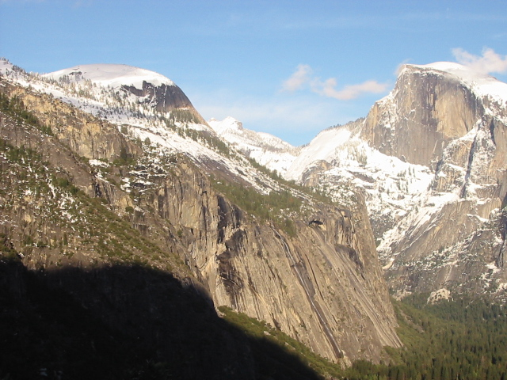

# CS5670 Computer Vision

## Project 3: Creating Panorama Pictures with Autostitch

### Introduction

Building our own Autostitch system to combine overlapping photographs into a single panorama

* Feature matching using ORB feature detector (opencv)

* Using RANSAC to align the photographs

* Blend the images with alpha blending (feathering)

* Correcting for drift and create 360° panoramas 

Detailed project description can be found [here](http://www.cs.cornell.edu/courses/cs5670/2024sp/projects/pa3/index.html).

### Steps

1. Take pictures on a tripod (or handheld)

2. Warp to spherical coordinates

3. Extract features

4. Match features

5. Align neighboring pairs using RANSAC

6. Write out list of neighboring translations

7. Correct for drift

8. Read in images and blend them

9. Crop the result and import into a viewer
  
### Structure

| Name         | Function                                        |
| ------------ | ----------------------------------------------- |
| /resources   | Images used to create panoramas                 |
| warp.py      | Warp images into spherical coordinates.         |
| alignment.py | Compute the alignment of image pairs.           |
| blend.py     | Stitch and blend the aligned images.            |
| test.py      | Test cases provided to test and debug our code  |
| gui.py       | Gui provided to create panorama                 |

#### Libraries used

* matplotlib=3.8.0
* numpy=1.21.5
* opencv=4.6.0
* pillow=10.0.1
* py-opencv=4.6.0
* pyparsing=3.0.9
* python=3.9
* pyttk=0.3.2
* scipy=1.7.3
* tk=8.6.12

### Results

### 1. Yosemite

#### Input
|  |  |
| ------------------------------------------------------------ | ------------------------------------------------------------ |
|  |  |

#### Panorama

Panorama with homography (Blend width 50)

Panorama with translation (Blend width 50)

### 2. Custom pictures

#### Input

These pictures were taken with the iPhone 15 Pro with 2mm focal length.

|  |  |  |
|-----------------------|-----------------------|-----------------------|
|  |  |  |
|  |  |  |

#### Panorama

The person (myself) in the final 360 panorama looks a bit blurry because the autostitch algorithm overlaps images based on the matched features. Since I was not positioned in the center of the camera for some images, those areas got blurred out.

